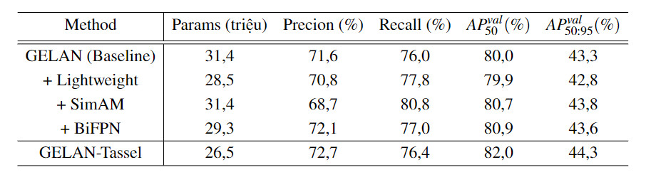
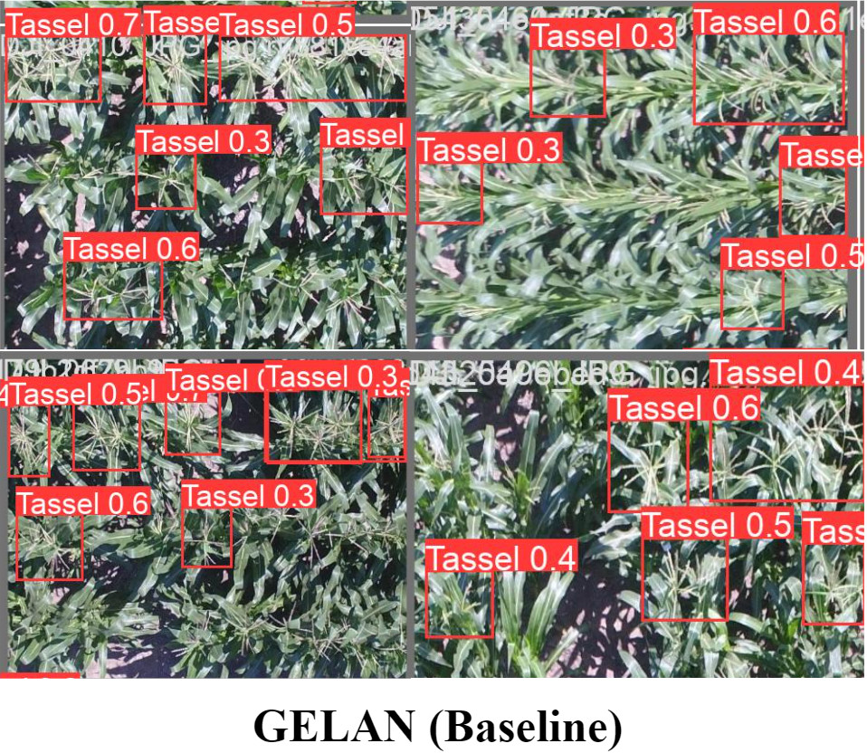

# Improving-the-GELAN-model-of-YOLOv9-for-tassel-detection-in-UAV-images
To address the issue of recognizing small objects, the research aims to enhance the GELAN model from YOLOv9 for improved detection of maize tassels. The focus is on developing a new detection model capable of identifying high maize tassel density with a reduced model size, facilitating integration into UAVs and enhancing aerial detection efficiency. The project prioritizes two main objectives:
- Firstly, improving and training the maize tassel detection model based on proposed variations of the YOLOv9-derived GELAN model. This enhancement aims to increase performance in detecting maize tassels and small objects from UAV imagery.
- Secondly, optimizing the model to reduce its size, thereby enhancing its applicability and integration into UAVs and other high-altitude detection devices.
- The model refinement focuses on enhancing the GELAN model's capability to detect tassels, aiming to improve performance, integration potential, and usability in UAV applications.

The new model, named GELAN-Tassel, has been enhanced for maize tassel detection. The improvement includes a feature extraction phase with a redesigned backbone that reduces the model size by 15.6% through the application of grouped convolution layers and ADown modules instead of regular convolution layers. This compact size enhances the model's versatility and applicability across various devices, particularly UAVs.

Another goal of the model enhancement is to enhance the accuracy of maize tassel detection. The BiFPN network replaces FPN to improve feature fusion for detecting small tassels. Additionally, the SimAM attention module is employed to extract crucial information and features from the feature maps.

The performance of the GELAN-Tassel model has been boosted to 82% on the maize-tassel dataset, an increase of 2%. Moreover, when tested on smaller maize tassels and larger image sizes, the model maintains significant performance at 83%, an improvement of 1.6% compared to the original model. It also performs notably well on entirely different datasets such as pedestrian detection, showcasing its potential applications in future scenarios such as rescue operations and urban area management...

#Training Evaluation Results

    

*** The model was modified from a paper YOLOv9 of WongKinYiu with github link: https://github.com/WongKinYiu/yolov9, license included.

